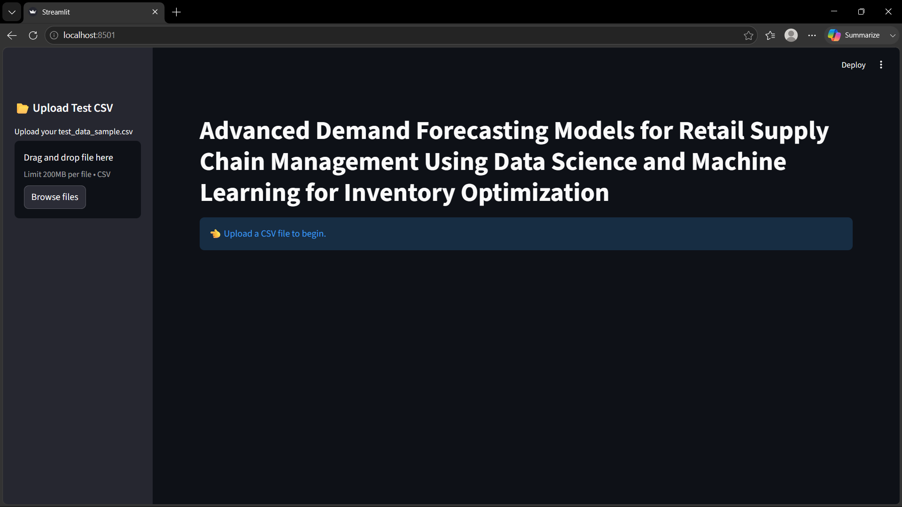
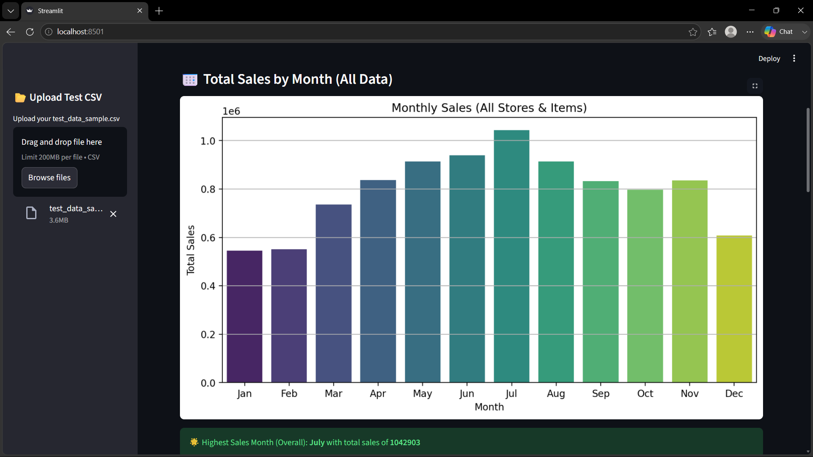
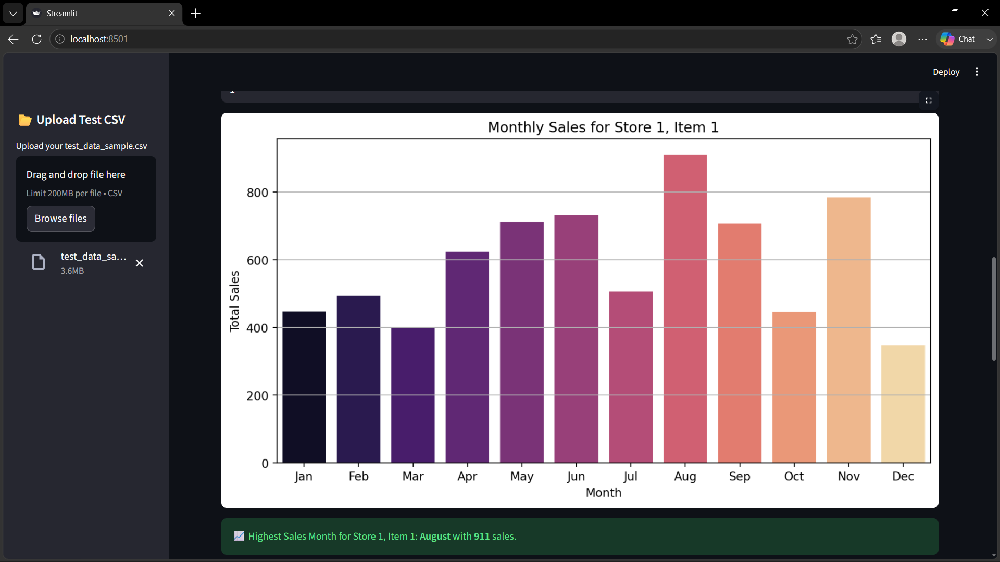
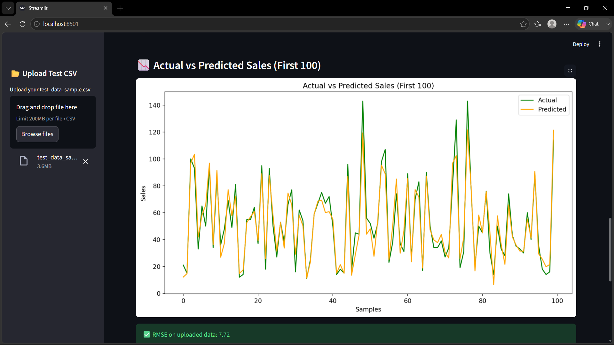

# Advanced Demand Forecasting System

A Machine Learning-based retail demand forecasting application developed using Python, XGBoost, and Streamlit for inventory optimization and sales prediction.

## Overview

This project predicts future product demand using historical retail sales data. The application provides an interactive dashboard where users can upload sales data, generate forecasts, analyze monthly trends, and compare actual versus predicted sales.

**Project Type:** Academic Major Project (Team of 5)

### My Contributions

* Data preprocessing and feature engineering
* XGBoost model integration
* Streamlit dashboard development
* Data visualization and sales analytics
* Testing and model evaluation

## Tech Stack

* Python
* XGBoost
* Pandas
* NumPy
* Streamlit
* Matplotlib
* Seaborn
* Scikit-learn
* Joblib

## Features

* Upload retail sales datasets using CSV files
* Generate demand forecasts using a trained XGBoost model
* Monthly sales trend analysis
* Store-wise and item-wise forecasting
* Actual vs Predicted sales comparison
* RMSE evaluation metric
* Interactive visualizations
* Download forecast results as CSV

## Project Structure

```text
Advanced-Demand-Forecasting-System/
│
├── app.py
├── xgboost_demand_forecast_model.pkl
├── test_data_sample_real.csv
├── requirements.txt
├── README.md
└── screenshots/
```

## Installation

```bash
pip install -r requirements.txt
```

## Run the Application

```bash
streamlit run app.py
```

## Screenshots

### Dashboard Home



### Overall Monthly Sales Analysis



### Store and Item Sales Analysis



### Actual vs Predicted Sales




* Multi-year forecasting support
* Cloud deployment
* Advanced inventory optimization recommendations
* Real-time demand forecasting
* Interactive business intelligence dashboards

## Demo Video

A short demonstration video of the application is available below.

[▶ Watch Demo Video](demo.mp4)

## Repository Maintained By

**Valluri Dileep Kumar**

B.Tech Computer Science and Engineering
Sir C.R. Reddy College of Engineering
